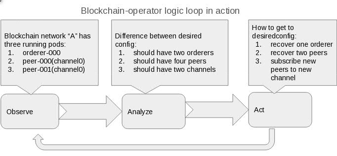
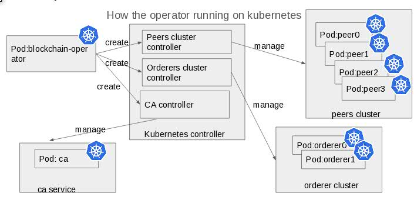
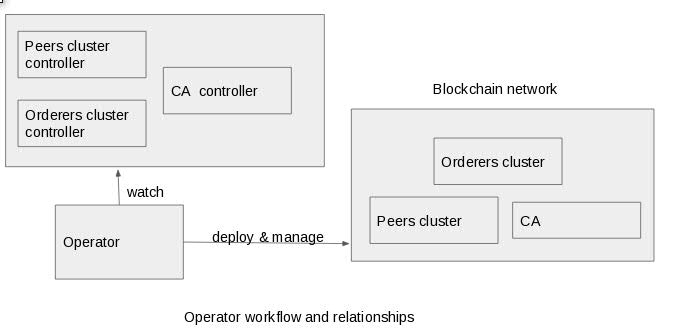

## Design and implementation
> An operator is just a go program running in a k8s pod, when it is starting, it will start two k8s TPRs, one is peer cluster controller and another is orderer service controller.
After operator started, it will start watching TPR event.
When orderer service or peer cluster create/destroy/update event triggered, the operator will do the synchronization.

## Resources for TPR
> When creating a orderer service or peer cluster instance, actually it will create a k8s secret, a k8s configMap, a k8s headless service, several k8s pods automatic.

## Diagram
- 
- 
- 
## How to try

## Prerequisite
- Kubernetes 1.6
- docker 1.12+

## Build
```
cd cmd/operator
GOOS=linux GOARCH=amd64 CGO_ENABLED=0 go build -o fabric-operator-alpine -installsuffix cgo -ldflags "$go_ldflags" .
cd ../..
docker build -t grapebaba/fabric-operator:latest .
```

## Run example local
- Start minikube
```
https_proxy=your_proxy minikube start --docker-env HTTP_PROXY=your_proxy --docker-env HTTPS_PROXY=your_proxy
```
- Start operator
```
kubectl create -f examples/example-operator.yaml
```
- Start a peer cluster
```
kubectl create -f examples/example-peercluster.yaml
```
- Start a orderer service
```
\kubectl create -f examples/example-ordererservice.yaml
```
- Reset
> Since delete function is not ready, please delete minikube and recreate for testing.